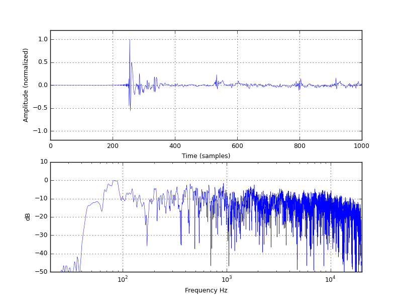
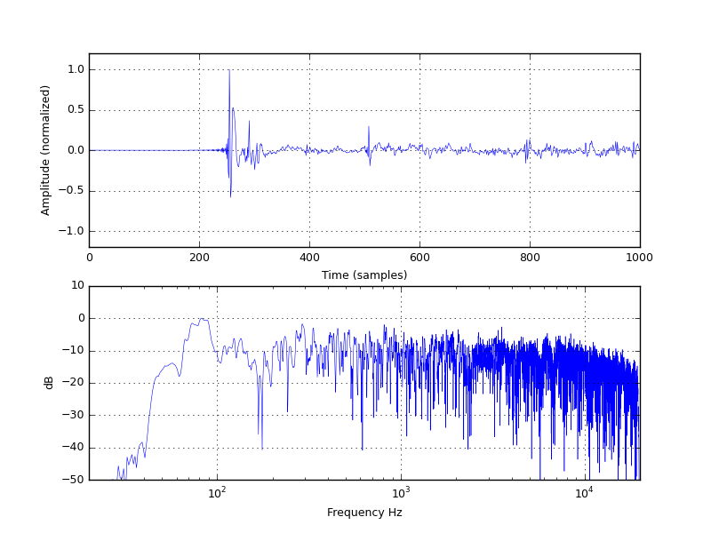
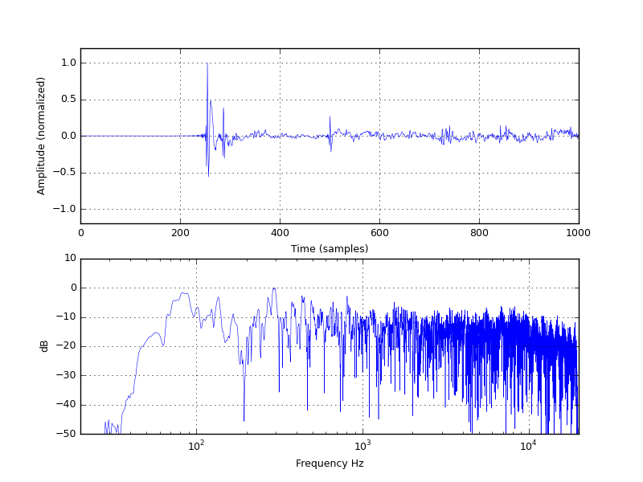
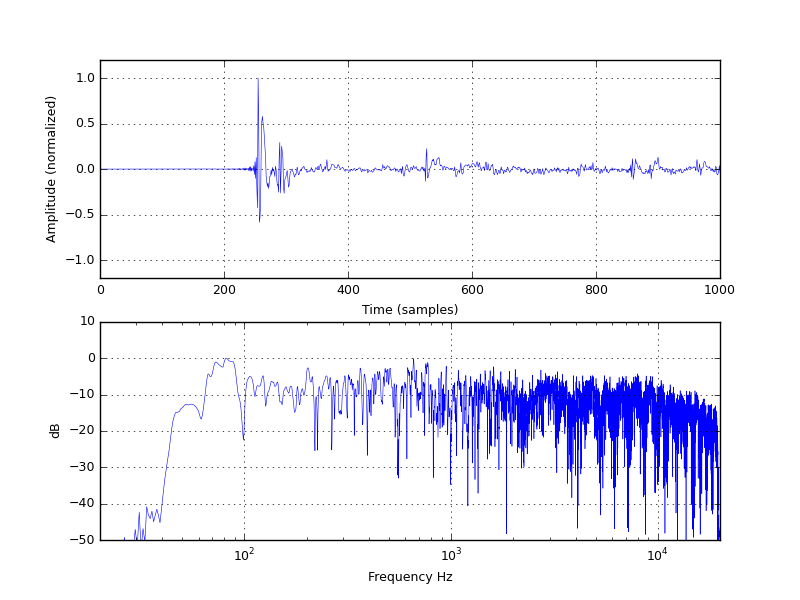
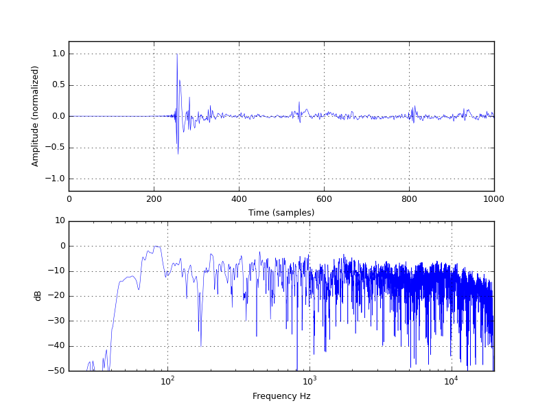
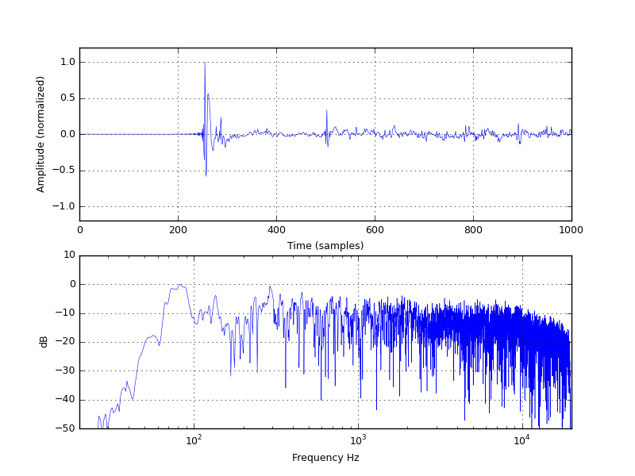
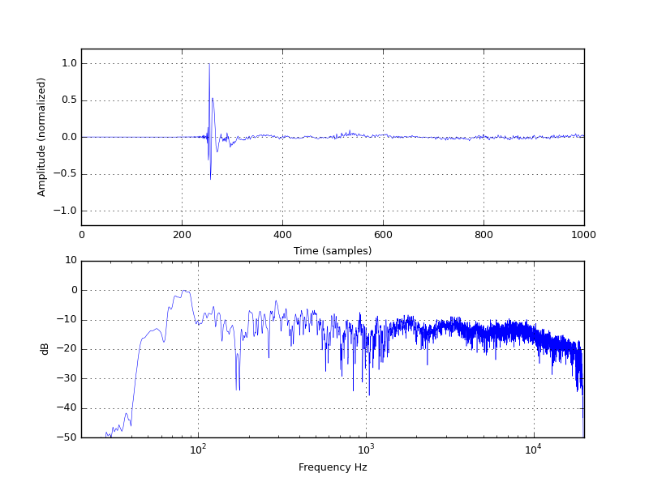
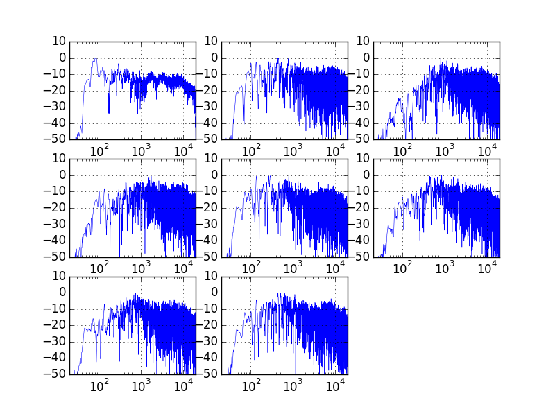

 # pyDRC tools
 
 ## 1. sweepgen.py
 
 sweepgen.py is a python script for sweep and inverse signals generation. Sweep signal should be used for measurement, while inverse signal is used for convolving with sweep acoustic measurements obtaining the impulse response we need for digital filtering/equalizacion.
 
 Script usage is simple:
 
 `python sweepgen.py sweep.xml [-s sweep_filename] [-i inverse_filename]`

sweep.xml is an xml file with sweep generation parameters. A sweep.xml sample is provided. Parameters:

- sample_rate: sweep wav sample rate in Hz
- Amplitude: sweep peak amplitude (max. value 1)
- Hzstart: sweep starting frequency in Hz
- HZend: sweep ending frequency in Hz
- length: sweep duration in seconds
- silence: intial and final silence length
- leadin: initial amplitude increase period
- leadout: final amplitude decrease period 

Output file names are defined by xml parameters or execution options.

sweep.xml sample:

```xml
<?xml version="1.0"?>
<generate_sweep>
  <params>
    <sample_rate>44100</sample_rate>
    <amplitude>0.5</amplitude>
    <Hzstart>20</Hzstart>
    <Hzend>20000</Hzend>
    <length>6</length>
    <silence>3</silence>
    <leadin>0.05</leadin>
    <leadout>0.005</leadout>
  </params>
  <sweep_filename>sweep_02.wav</sweep_filename>
  <inverse_filename>inverse_02.wav</inverse_filename>
</generate_sweep>
```

## 2. lsconv.py

This script convolves a measured sweep signal with teh corresponding inverse signal geneating the acoustic impulse response. Script usage is simple:

`python lsconv.py measurement.wav inverse.wav impulse.wav`

impulse.wav is the convolution result.

## 3. pca_analysis.py

One of the main issues of Digital Room Correction is that speaker equalization algorithms are based of one single point sweep measurement with an omnidirectional microphone. This script is able to load several impulse responses, measured at different points in the room,and calculate a new impulse response which is the main component of a [Principal Component Analysis](https://en.wikipedia.org/wiki/Principal_component_analysis) (PCA) performed over all the impulses responses. The loaded impulse response set should be measured around a small area of interest (p.e. about 0.5 x 0.5 meters around one or two listening points). 

Let's see a sample about how to use pca_analysis.py:

We have 8 different measurements over a small listening area:

- Impulse response 1:


- Impulse response 2:


Impulse response 3:


Impulse response 4:


Impulse response 5:


Impulse response 6:


Impulse response 7:


Impulse response 8:


After running pca_analysis over this set of measurements, the PCA principal component is:



And the frequency spectra of all the 8 components resulting of PCA analysis is:


